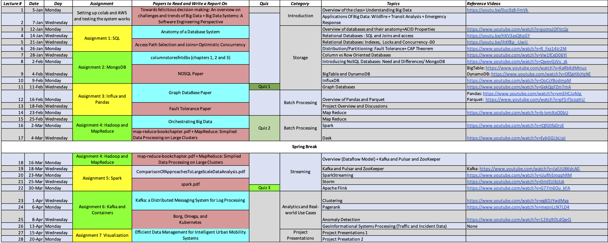

# Lectures - Topics in Big Data CS:4266/5266

The goal of this class is to cover the concepts and recent progress made in the area of Big Data. The focus will be on principles and practices of data storage, data modeling techniques, data processing and querying, data analytics, and applications of machine learning using these systems. Throughout the class, you will learn about the applications of these topics in real-world case studies such as public transit systems and Emergency Response Systems. Visit the following sites and look at the dashboards to see an example of how we use these techniques for some of our projects.

 * https://smarttransit.ai/
 * https://statresp.ai
 * https://github.com/smarttransit-ai/transit-occupancy-dashboard 
 * https://wego.smarttransit.ai/

 # Expectations

It is expected that the student taking this course is familiar with concepts like git, ssh, and cloud computing. Also, the primary programming language to be used in the course is Python, which is one of the common languages used in data science and big data systems. Though we will use cloud computing resources for all assignments it is going to be important that you have a working computer with access to a terminal. As a starting point feel free to already install Python 3.10 on your system. You can use anaconda if you are familiar with it. But any other Python3.10 environment will be okay. You can also use Google Colab if you prefer. Lastly, you will be assigned papers on some key topics and will be expected to read and write a report, which will be graded.
 
# Tools Used in The class

* Amazon Web Services
* Google Colab or your own python environment on your machine. Look below to setup the python environment if you chose to not use google colab.
* Brightspace for grading and class materials.
* Github for assignments
* Microsoft Teams for Discussions (very similar to slack)
* Zoom for communication

# Instructions

We have curated a set of instructional links and useful videos to understand the various technologies that you will be using in the course. All this material is available as a module in the class content.  

# Examples

You will find a number of examples, python notebooks and sample exercises in the [github repository](https://github.com/vu-topics-in-big-data-2026/). You cannot edit it. But you can fork the examples repository and then run the examples in your own github account -- separate from the organization of the class. It will be your responsibility to keep your local version of examples up to date.  

Take a look at https://gist.github.com/CristinaSolana/1885435 and https://docs.github.com/en/github/collaborating-with-issues-and-pull-requests/syncing-a-fork

# Python Environment
For example, a very simple way to set Anaconda python is to install it on your machine and then create an environment. Just follow the instructions at https://github.com/vu-topics-in-big-data-2026/class-python-environment. Alternatively, you can also just use [google colab](https://towardsdatascience.com/getting-started-with-google-colab-f2fff97f594c). See instructions in the instruction folder on bright space.

# Course Outline 

Please see the [schedule](https://docs.google.com/spreadsheets/d/1YzeA1oDXGsR1y-O2oJKQyRCGJ0k8RabcWKlYBleppEs/edit?usp=sharing)

The schedule is also available as a [pdf in the repository](schedule-of-the-class.pdf).

## Instructors

- Prof. JP Talusan (Lead Instructor) (Available by Appointments on Thursdays 2-3 PM US Central)
- Mr. Ammar Zulqarnain (PhD Candidate, Role: TA) (Available by appointments 12-1 Central Monday and 3 PM-4PM Central on Wednesday. Zoom Link in Brightspace)
- TBD (Role: Undergraduate Grader)

 
If you are interested in the research work of the team visit: https://scopelab.ai/

## Evaluation Criteria

The following grading criteria are tentative and are
subject to change. Each graded item in this course will be assigned a
certain number of points. Your final grade will be computed as the total
number of points you achieved divided by the number of points possible.
The instructor reserves the right to apply a curve to the final result.

| Category        | Percentage  |
| ------------- |:-------------:| 
| Programming Assignments    | 40% | 
| Paper Reports | 25%|
| Final Project       | 20% |
| Quizzes          | 10% |
| Survey and Class Participation| 5%|

**Important (late submissions):** Submissions will be due by midnight on the day mentioned in the assignment and homework description. Late submissions will be penalized with an automatic 20 percent penalty per day (applied relative to the graded score for the submission). Also, no collaboration is allowed unless explicitly cleared by the Instructors.  Please see the honor policy statement below.

**Honor Policy:** In terms of this course, the basic rule is this -- all work submitted in this class must be done completely on your own without assistance from any person, place, or thing except the instructors or TAs for this course and the course materials, papers provided and course lecture slides. If you have any doubts, ask your instructor for clarification, not another student (not even the teaching assistants).

**Generative AI Use:** Any use of generative AI must be disclosed in a short statement at the end of the submission describing:
- The tool used
- How it was used
- What portions of the work were affected

Failure to disclose AI use will be treated as a violation of the course Honor Policy. AI use is welcome as long as it will help you understand the course content better.

## Letter Grade Distribution

| Score        | Letter  |
| ------------- |:-------------:| 
| >= 93.00    |   A      |
| 90.00 - 92.99  |  A-   |
| 87.00 - 89.99 | B+     |
| 83.00 - 86.99  | B     |
| 80.00 - 82.99  | B-     |
| 77.00 - 79.99  | C+  |
| 73.00 - 76.99  | C  |
| 70.00 - 72.99  | C-  |
| 67.00 - 69.99  | D+  |
| 63.00 - 66.99  | D  |
| 60.00 - 62.99  | D-  |
| <= 59.99   |  F  |

The Instructor reserves the right to apply a curve to the final grades.

## Disability Statement

Vanderbilt is committed to equal opportunity
for students with disabilities. If you have a physical or learning
disability, you should ask the Opportunity Development Center to assist
you in identifying yourself to your instructors as having a disability,
so that appropriate accommodation may be provided. Without notification,
your instructors assume that you have no disabilities or seek no
accommodation.
